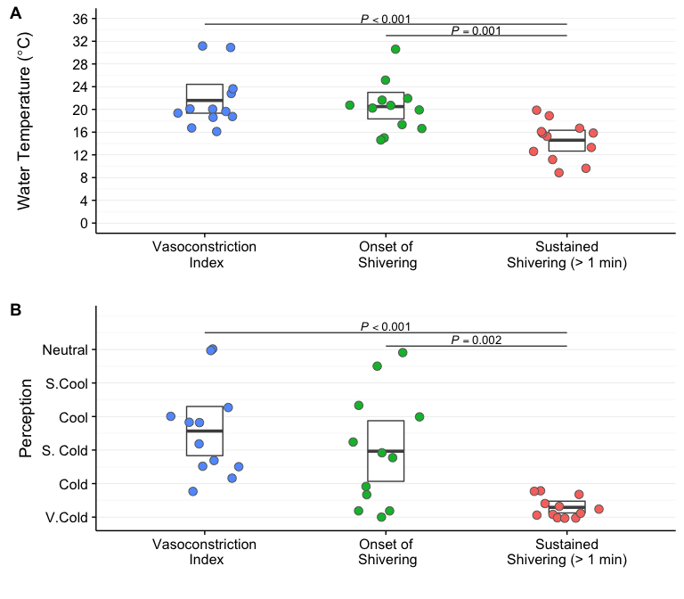
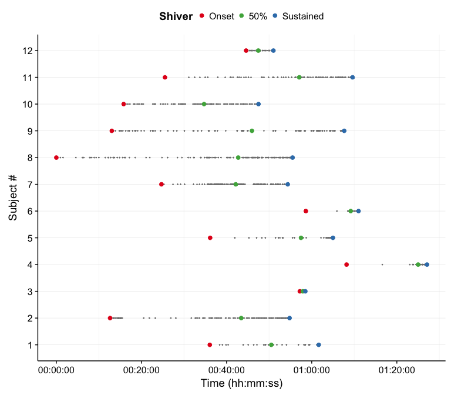
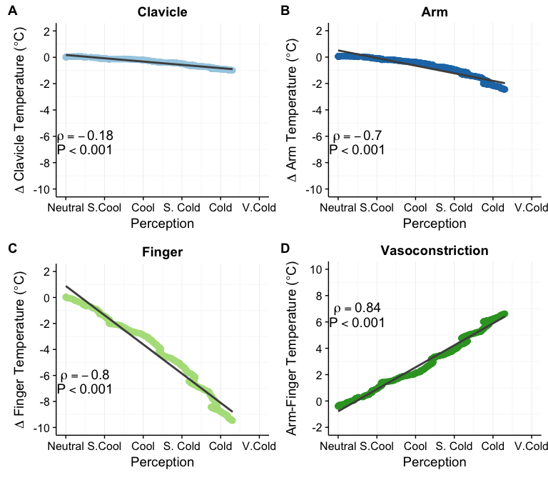
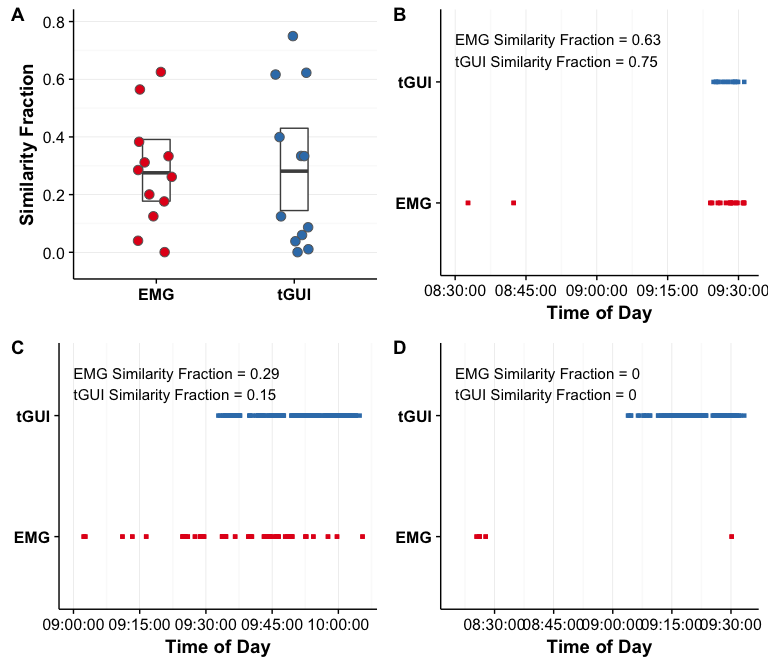

Cooling Protocol Reproducible Analysis
================
Crystal Coolbaugh
2017-10-17

-   [Reproducible Analysis](#reproducible-analysis)
-   [What is R Markdown?](#what-is-r-markdown)
-   [Getting Started](#getting-started)
-   [Tidy Data](#tidy-data)
-   [Setup Requirements](#setup-requirements)
-   [Third Party Contributions](#third-party-contributions)
    -   [SummarySE - Between Subject Error](#summaryse---between-subject-error)
    -   [SummarySEwithin - Within Subjects Error](#summarysewithin---within-subjects-error)
-   [Table 3: Subject Demographics Summary](#table-3-subject-demographics-summary)
-   [Figure 2: Individual Variability in Water Temperature and Perception of Cooling](#figure-2-individual-variability-in-water-temperature-and-perception-of-cooling)
    -   [Water Temperature Summary](#water-temperature-summary)
    -   [Perception of Cooling Summary](#perception-of-cooling-summary)
    -   [Mixed-Effects Modeling](#mixed-effects-modeling)
-   [Figure 3: Individual Variability in Shivering Response](#figure-3-individual-variability-in-shivering-response)
-   [Figure 4: Skin Temperature Relates to Perception of Cooling](#figure-4-skin-temperature-relates-to-perception-of-cooling)
    -   [Spearman Rank Correlation](#spearman-rank-correlation)
    -   [Change in Skin Temperature Pre- and Post-Cooling Protocol](#change-in-skin-temperature-pre--and-post-cooling-protocol)
-   [Figure 6: Similarity of EMG and tGUI Shiver Events](#figure-6-similarity-of-emg-and-tgui-shiver-events)
    -   [tGUI and EMG Similarity Summary](#tgui-and-emg-similarity-summary)

Reproducible Analysis
---------------------

In the spirit of reproducible analysis, we created a R Markdown document to share how data were analyzed and plotted in our *Frontiers Integrative Physiology* Methods article: "An Individualized, Perception-Based Protocol to Investigate Human Physiological Responses to Cooling."

What is R Markdown?
-------------------

R Markdown documents are a tool to format text, code, and output in markdown language. For more details on using R Markdown see <http://rmarkdown.rstudio.com>.

Getting Started
---------------

To get started, you must have **R** and **RStudio** installed on your computer. You can download each of these programs using the following links:

-   [The R Project for Statistical Computing](https://www.r-project.org/ "R Homepage")
-   [R Studio](https://www.rstudio.com/products/rstudio/download/ "RStudio Download")

We used R version 3.3.3 (2017-03-06) and RStudio version 1.0.153 for Mac OS to create this code.

For clarity, some of the code used to generate tables and figures are not displayed in this file. To view the complete R code, **download** and **open** the R markdown file (.Rmd) in R studio. Alternatively, you can click on the view 'raw' mode in Github to see the code in your web browser.

Tidy Data
---------

All data pertaining to the statistical analyses and figures presented in the manuscript are stored in the **/tidy\_data folder** in this repository. Please refer to the **data dictionary** included in this folder to learn more about the contents of each .csv file.

Setup Requirements
------------------

Statistical analyses included in this R markdown file require specific **R** libraries. These libraries must be installed on your computer prior to running the code.

If you have not used R previously, run the following code in your RStudio console to install the necessary packages prior to executing the R markdown file.

``` r
install.packages(plyr)
install.packages(dplyr)
install.packages(tidyr)
install.packages(ggplot2)
install.packages(cowplot)
install.packages(nlme)
install.packages(multcomp)
install.packages(plotrix)
install.packages(knitr)
install.packages(scales)
```

Once the **R** libraries are installed on your computer, the following code initializes the package for use in the subsequent analyses.

``` r
library(plyr)       #data manipulation
library(dplyr)      #data manipulation 
library(tidyr)      #data manipulation
library(ggplot2)    #plot tools
library(cowplot)    #plot format tools 
library(nlme)       #linear model
library(multcomp)   #post hoc tests
library(plotrix)    #standard error function 
library(knitr)      #r markdown format tools
library(scales)     #plot time 
```

Third Party Contributions
-------------------------

The `summarySE` and `summarySEwithin` helper functions were used to calculate mean, standard deviation, standard error of the mean, and 95% confidence intervals for between subjects and within subjects variables, respectively. For more details about these functions see the R Cookbook page <http://www.cookbook-r.com/Graphs/Plotting_means_and_error_bars_(ggplot2)>.

### SummarySE - Between Subject Error

``` r
## Gives count, mean, standard deviation, standard error of the mean, and confidence interval (default 95%).
##   data: a data frame.
##   measurevar: the name of a column that contains the variable to be summariezed
##   groupvars: a vector containing names of columns that contain grouping variables
##   na.rm: a boolean that indicates whether to ignore NA's
##   conf.interval: the percent range of the confidence interval (default is 95%)

## Source: http://www.cookbook-r.com/Graphs/Plotting_means_and_error_bars_(ggplot2)/

summarySE <- function(data=NULL, measurevar, groupvars=NULL, na.rm=FALSE,
                      conf.interval=.95, .drop=TRUE) {
  library(plyr)
  
  # New version of length which can handle NA's: if na.rm==T, don't count them
  length2 <- function (x, na.rm=FALSE) {
    if (na.rm) sum(!is.na(x))
    else       length(x)
  }
  
  # This does the summary. For each group's data frame, return a vector with
  # N, mean, and sd
  datac <- ddply(data, groupvars, .drop=.drop,
                 .fun = function(xx, col) {
                   c(N    = length2(xx[[col]], na.rm=na.rm),
                     mean = mean   (xx[[col]], na.rm=na.rm),
                     sd   = sd     (xx[[col]], na.rm=na.rm)
                   )
                 },
                 measurevar
  )
  
  # Rename the "mean" column    
  datac <- rename(datac, c("mean" = measurevar))
  
  datac$se <- datac$sd / sqrt(datac$N)  # Calculate standard error of the mean
  
  # Confidence interval multiplier for standard error
  # Calculate t-statistic for confidence interval: 
  # e.g., if conf.interval is .95, use .975 (above/below), and use df=N-1
  ciMult <- qt(conf.interval/2 + .5, datac$N-1)
  datac$ci <- datac$se * ciMult
  
  return(datac)
}
```

### SummarySEwithin - Within Subjects Error

``` r
## Summarizes data, handling within-subjects variables by removing inter-subject variability.
## It will still work if there are no within-S variables.
## Gives count, un-normed mean, normed mean (with same between-group mean),
##   standard deviation, standard error of the mean, and confidence interval.
## If there are within-subject variables, calculate adjusted values using method from Morey (2008).
##   data: a data frame.
##   measurevar: the name of a column that contains the variable to be summariezed
##   betweenvars: a vector containing names of columns that are between-subjects variables
##   withinvars: a vector containing names of columns that are within-subjects variables
##   idvar: the name of a column that identifies each subject (or matched subjects)
##   na.rm: a boolean that indicates whether to ignore NA's
##   conf.interval: the percent range of the confidence interval (default is 95%)

## Source: http://www.cookbook-r.com/Graphs/Plotting_means_and_error_bars_(ggplot2)/

summarySEwithin <- function(data=NULL, measurevar, betweenvars=NULL, withinvars=NULL,
                            idvar=NULL, na.rm=FALSE, conf.interval=.95, .drop=TRUE) {

  # Ensure that the betweenvars and withinvars are factors
  factorvars <- vapply(data[, c(betweenvars, withinvars), drop=FALSE],
    FUN=is.factor, FUN.VALUE=logical(1))

  if (!all(factorvars)) {
    nonfactorvars <- names(factorvars)[!factorvars]
    message("Automatically converting the following non-factors to factors: ",
            paste(nonfactorvars, collapse = ", "))
    data[nonfactorvars] <- lapply(data[nonfactorvars], factor)
  }

  # Get the means from the un-normed data
  datac <- summarySE(data, measurevar, groupvars=c(betweenvars, withinvars),
                     na.rm=na.rm, conf.interval=conf.interval, .drop=.drop)

  # Drop all the unused columns (these will be calculated with normed data)
  datac$sd <- NULL
  datac$se <- NULL
  datac$ci <- NULL

  # Norm each subject's data
  ndata <- normDataWithin(data, idvar, measurevar, betweenvars, na.rm, .drop=.drop)

  # This is the name of the new column
  measurevar_n <- paste(measurevar, "_norm", sep="")

  # Collapse the normed data - now we can treat between and within vars the same
  ndatac <- summarySE(ndata, measurevar_n, groupvars=c(betweenvars, withinvars),
                      na.rm=na.rm, conf.interval=conf.interval, .drop=.drop)

  # Apply correction from Morey (2008) to the standard error and confidence interval
  #  Get the product of the number of conditions of within-S variables
  nWithinGroups    <- prod(vapply(ndatac[,withinvars, drop=FALSE], FUN=nlevels,
                           FUN.VALUE=numeric(1)))
  correctionFactor <- sqrt( nWithinGroups / (nWithinGroups-1) )

  # Apply the correction factor
  ndatac$sd <- ndatac$sd * correctionFactor
  ndatac$se <- ndatac$se * correctionFactor
  ndatac$ci <- ndatac$ci * correctionFactor

  # Combine the un-normed means with the normed results
  merge(datac, ndatac)
}
```

Table 3: Subject Demographics Summary
-------------------------------------

Univariate statistics (e.g. max, mean, min, and standard error) were used to summarize subject demographics and test conditions.

``` r
# Import Table 3 Tidy Data
Tab3.Data<-read.csv(file=file.path("tidy_data","data_tab3_subject_demographics.csv"),header=TRUE)
```

``` r
# Summarize Mean & Standard Error
Demo.Sum<- Tab3.Data %>% dplyr::select(Age:HumIn) %>%
  summarise_all(funs(Mean = mean, SE = std.error, Min = min, Max = max)) %>%
  gather(key, value) %>%
  separate(key, into=c("var","stat")) %>%
  unite(stat_Group, stat) %>%
  spread(stat_Group, value)

# Display Table
knitr::kable(Demo.Sum,format = "markdown", digits=c(0,1,1,1,1), 
             col.names = c("", "Max", "Mean","Min","SE"))
```

|         |    Max|   Mean|   Min|   SE|
|:--------|------:|------:|-----:|----:|
| Age     |   34.0|   26.2|  19.0|  1.4|
| BMI     |   27.7|   23.2|  19.3|  0.7|
| Height  |  195.6|  162.3|  68.0|  9.0|
| HumIn   |   82.0|   42.0|   7.0|  6.5|
| HumOut  |  100.0|   70.8|  43.0|  5.3|
| Mass    |   91.6|   69.5|  54.9|  3.4|
| TempIn  |   24.0|   20.4|  13.0|  0.9|
| TempOut |   26.0|    9.9|  -6.0|  3.2|
| WC      |   97.2|   81.4|  69.3|  2.3|

Figure 2: Individual Variability in Water Temperature and Perception of Cooling
-------------------------------------------------------------------------------

Water temperature values (°C; **A**) and subjective perception ratings (arbitrary units; **B**) exhibit a wide range of variability between subjects at three physiological and temporally distinct events: vasoconstriction index (&gt; 4 °C gradient between forearm and finger skin temperature; VC), onset of shivering (first self-reported shiver event; S\_On), and sustained shivering (self-reported shiver event with a duration &gt; 1 minute; S\_End) in the perception-based cooling protocol.The centerline in each box indicates the mean value, and the top and bottom of the box mark the 95 % confidence intervals.

``` r
# Import tidy_data
Fig2.Data<-read.csv(file=file.path("tidy_data","data_fig2_water_tgui_variability.csv"), header=TRUE)

# Convert IdxType (variable index) to Factor
as.factor(Fig2.Data$IdxType)
```



### Water Temperature Summary

``` r
# Calculate Mean, SE, and 95% Confidence Intervals
# Detach dplyr library to avoid conflict with summarySE function
detach("package:dplyr",unload=TRUE)
H20.SE<-summarySE(Fig2.Data,measurevar="H20",groupvars="IdxType",na.rm=FALSE,conf.interval=.95,.drop=TRUE)

knitr::kable(H20.SE,format = "markdown", digits=c(0,0,2,2,2,2,2), 
             col.names = c("Index", "N", "Mean","SD", "SE", "95 CI")) 
```

| Index  |    N|   Mean|    SD|    SE|  95 CI|
|:-------|----:|------:|-----:|-----:|------:|
| S\_End |   12|  14.58|  3.45|  1.00|   2.19|
| S\_On  |   12|  20.50|  4.48|  1.29|   2.85|
| VC     |   12|  21.58|  4.91|  1.42|   3.12|

### Perception of Cooling Summary

``` r
tGUI.SE<-summarySE(Fig2.Data,measurevar="tGUI",groupvars="IdxType",na.rm=FALSE,conf.interval=.95,.drop=TRUE) 

knitr::kable(tGUI.SE,format = "markdown", digits=c(0,0,2,2,2,2,2), 
             col.names = c("Index", "N", "Mean","SD", "SE", "95 CI"))
```

| Index  |    N|   Mean|     SD|    SE|  95 CI|
|:-------|----:|------:|------:|-----:|------:|
| S\_End |   12|   2.92|   3.12|  0.90|   1.98|
| S\_On  |   12|  19.67|  16.74|  4.83|  10.63|
| VC     |   12|  25.67|  13.76|  3.97|   8.74|

``` r
library(dplyr)
```

### Mixed-Effects Modeling

Tukey’s post hoc pairwise tests were performed following a linear mixed-effects analysis with repeated measures to assess statistical comparisons.

``` r
#Augmented Model -- dependent variable is predicted by the independent variable (repeated within subjects)
H20Model<- lme(H20 ~ IdxType, random =~1 | ID/IdxType, data=Fig2.Data, method="ML")
tGUIModel<- lme(tGUI ~ IdxType, random =~1 | ID/IdxType, data=Fig2.Data, method="ML")

#PostHoc Tests
H20posthoc <- glht(H20Model, linfct = mcp(IdxType = "Tukey"))
summary(H20posthoc)
```

    ## 
    ##   Simultaneous Tests for General Linear Hypotheses
    ## 
    ## Multiple Comparisons of Means: Tukey Contrasts
    ## 
    ## 
    ## Fit: lme.formula(fixed = H20 ~ IdxType, data = Fig2.Data, random = ~1 | 
    ##     ID/IdxType, method = "ML")
    ## 
    ## Linear Hypotheses:
    ##                   Estimate Std. Error z value Pr(>|z|)    
    ## S_On - S_End == 0    5.917      1.690   3.501  0.00136 ** 
    ## VC - S_End == 0      7.000      1.690   4.142  < 0.001 ***
    ## VC - S_On == 0       1.083      1.690   0.641  0.79742    
    ## ---
    ## Signif. codes:  0 '***' 0.001 '**' 0.01 '*' 0.05 '.' 0.1 ' ' 1
    ## (Adjusted p values reported -- single-step method)

``` r
tGUIposthoc <- glht(tGUIModel, linfct = mcp(IdxType = "Tukey"))
summary(tGUIposthoc)
```

    ## 
    ##   Simultaneous Tests for General Linear Hypotheses
    ## 
    ## Multiple Comparisons of Means: Tukey Contrasts
    ## 
    ## 
    ## Fit: lme.formula(fixed = tGUI ~ IdxType, data = Fig2.Data, random = ~1 | 
    ##     ID/IdxType, method = "ML")
    ## 
    ## Linear Hypotheses:
    ##                   Estimate Std. Error z value Pr(>|z|)    
    ## S_On - S_End == 0   16.750      4.841   3.460   0.0016 ** 
    ## VC - S_End == 0     22.750      4.841   4.699   <0.001 ***
    ## VC - S_On == 0       6.000      4.841   1.239   0.4299    
    ## ---
    ## Signif. codes:  0 '***' 0.001 '**' 0.01 '*' 0.05 '.' 0.1 ' ' 1
    ## (Adjusted p values reported -- single-step method)

Figure 3: Individual Variability in Shivering Response
------------------------------------------------------

The onset and intensity of self-reported shivering differed between subjects during the perception-based cooling protocol. Onset, 50% (of total shiver events), and sustained shivering (&gt; 1 min in duration) events are highlighted.

``` r
# Import Figure 3 Tidy Data
Fig3.Data<-read.csv(file=file.path("tidy_data","data_fig3_shiver_variability.csv"),header=TRUE)

# Convert x axis to time variable 
Fig3.Data$pts<-as.POSIXct(Fig3.Data$pts,format="%H:%M:%S")
```



Figure 4: Skin Temperature Relates to Perception of Cooling
-----------------------------------------------------------

Clavicle (°C; **A**), forearm (°C; **B**), finger (°C; **C**), and peripheral vasoconstriction (forearm – finger, °C; **D**) skin temperatures related with subjective perception of cooling ratings. Relative skin temperatures are expressed as the change (Δ) in temperature from the end of the thermoneutral phase. Least squares best-fit lines are overlaid on the temperature data, which were linearly interpolated and averaged between subjects. Small upward fluctuations in the temperature gradient (most notable in the finger skin temperature) were the result of two subjects indicating a warmer perception rating when water temperature was adjusted (i.e. a brief influx of warm water).

``` r
# Import Figure 4 Tidy Data
Fig4.Data<-read.csv(file=file.path("tidy_data","data_fig4_skintemp_tgui_relation.csv"),header=TRUE)

# Group According to Timepoint and Calculate Mean
SkinTemp.Sum<-Fig4.Data %>% dplyr::select(time:VC) %>% group_by(time) %>% summarise_all(funs(mean))
```



### Spearman Rank Correlation

Correlation (ρ) between temperature (CR = Relative Clavicle Temperature; AR = Relative Arm Temperature; FR = Relative Finger Temperature; VC = Arm - Finger Temperature Gradient) and perception was evaluated with the Spearman rank test.

#### Clavicle Correlation

``` r
### Relationship between Skin Temperature and Perception
#Calculate Correlation Coefficients - Spearman Rank Method
#Clavicle
cor.test(Fig4.Data$tGUI, Fig4.Data$CR,method=c("spearman"))
```

    ## 
    ##  Spearman's rank correlation rho
    ## 
    ## data:  Fig4.Data$tGUI and Fig4.Data$CR
    ## S = 2.5045e+10, p-value < 2.2e-16
    ## alternative hypothesis: true rho is not equal to 0
    ## sample estimates:
    ##       rho 
    ## 0.1842779

#### Arm Correlation

``` r
#Arm
cor.test(Fig4.Data$tGUI, Fig4.Data$AR,method=c("spearman"))
```

    ## 
    ##  Spearman's rank correlation rho
    ## 
    ## data:  Fig4.Data$tGUI and Fig4.Data$AR
    ## S = 9161100000, p-value < 2.2e-16
    ## alternative hypothesis: true rho is not equal to 0
    ## sample estimates:
    ##       rho 
    ## 0.7016254

#### Finger Correlation

``` r
#Finger
cor.test(Fig4.Data$tGUI, Fig4.Data$FR,method=c("spearman"))
```

    ## 
    ##  Spearman's rank correlation rho
    ## 
    ## data:  Fig4.Data$tGUI and Fig4.Data$FR
    ## S = 6003400000, p-value < 2.2e-16
    ## alternative hypothesis: true rho is not equal to 0
    ## sample estimates:
    ##       rho 
    ## 0.8044718

#### Vasoconstriction Correlation

``` r
#Vasoconstriction (Arm - Finger Skin Temperature)
cor.test(Fig4.Data$tGUI, Fig4.Data$VC,method=c("spearman"))
```

    ## 
    ##  Spearman's rank correlation rho
    ## 
    ## data:  Fig4.Data$tGUI and Fig4.Data$VC
    ## S = 5.6579e+10, p-value < 2.2e-16
    ## alternative hypothesis: true rho is not equal to 0
    ## sample estimates:
    ##        rho 
    ## -0.8427509

### Change in Skin Temperature Pre- and Post-Cooling Protocol

Paired samples Wilcoxon signed rank tests were performed to compare pre- (end of thermoneutral phase) and post- (end of protocol) alterations in relative skin temperatures (Order of Tests: Clavice; Arm; Finger; Vasoconstriction).

``` r
# Import Pre-/Post-Cooling Temperature Tidy Data
PrePost.Data<-read.csv(file=file.path("tidy_data","data_stats_skintemp_prepost.csv"),header=TRUE)
```

``` r
# Group Pre-/Post-Temperatures According to Anatomical Location
SkinTemp.Clav<-PrePost.Data %>% filter(Location=="Clav")
SkinTemp.Arm<-PrePost.Data %>% filter(Location=="Arm")
SkinTemp.Fing<-PrePost.Data %>% filter(Location=="Fing")
SkinTemp.VC<-PrePost.Data %>% filter(Location=="VC")

# Wilcoxon Signed-Rank Test: Pre/Post Temperature Changes
# Each Temperature Location Failed Normality Assumption (Shapiro-Wilk Test)
# Clavicle
wilcox.test(Temp ~ Condition, data=SkinTemp.Clav, paired = TRUE, alternative = "two.sided")
```

    ## 
    ##  Wilcoxon signed rank test
    ## 
    ## data:  Temp by Condition
    ## V = 13, p-value = 0.1602
    ## alternative hypothesis: true location shift is not equal to 0

``` r
# Arm
wilcox.test(Temp ~ Condition, data=SkinTemp.Arm, paired = TRUE, alternative = "two.sided")
```

    ## 
    ##  Wilcoxon signed rank test
    ## 
    ## data:  Temp by Condition
    ## V = 0, p-value = 0.001953
    ## alternative hypothesis: true location shift is not equal to 0

``` r
# Finger
wilcox.test(Temp ~ Condition, data=SkinTemp.Fing, paired = TRUE, alternative = "two.sided")
```

    ## 
    ##  Wilcoxon signed rank test
    ## 
    ## data:  Temp by Condition
    ## V = 0, p-value = 0.001953
    ## alternative hypothesis: true location shift is not equal to 0

``` r
# Vascoconstriction (Arm-Finger Skin Temperature)
wilcox.test(Temp ~ Condition, data=SkinTemp.VC, paired = TRUE, alternative = "two.sided")
```

    ## 
    ##  Wilcoxon signed rank test
    ## 
    ## data:  Temp by Condition
    ## V = 55, p-value = 0.001953
    ## alternative hypothesis: true location shift is not equal to 0

``` r
# Calculate Skin Temperature within Subject Error and 95% Confidence Intervals & Display Tables
detach("package:dplyr",unload=TRUE)
# Clavicle
Clav.Error<-summarySEwithin(SkinTemp.Clav,measurevar="Temp",withinvars="Condition",idvar="ID",na.rm=FALSE,conf.interval=.95)

knitr::kable(Clav.Error,format = "markdown", digits=c(0,0,2,2,2,2,2), 
             col.names = c("Time Point", "N", "Mean","Norm Mean","SD", "SE", "95 CI"))
```

| Time Point |    N|   Mean|  Norm Mean|    SD|    SE|  95 CI|
|:-----------|----:|------:|----------:|-----:|-----:|------:|
| Post       |   10|  -0.99|      -0.99|  1.04|  0.33|   0.74|
| Pre        |   10|   0.01|       0.01|  1.04|  0.33|   0.74|

``` r
# Arm
Arm.Error<-summarySEwithin(SkinTemp.Arm,measurevar="Temp",withinvars="Condition",idvar="ID",na.rm=FALSE,conf.interval=.95)

knitr::kable(Arm.Error,format = "markdown", digits=c(0,0,2,2,2,2,2), 
             col.names = c("Time Point", "N", "Mean","Norm Mean","SD", "SE", "95 CI"))
```

| Time Point |    N|   Mean|  Norm Mean|    SD|    SE|  95 CI|
|:-----------|----:|------:|----------:|-----:|-----:|------:|
| Post       |   10|  -2.44|      -2.44|  0.71|  0.23|   0.51|
| Pre        |   10|   0.04|       0.04|  0.71|  0.23|   0.51|

``` r
# Finger
Fing.Error<-summarySEwithin(SkinTemp.Fing,measurevar="Temp",withinvars="Condition",idvar="ID",na.rm=FALSE,conf.interval=.95)

knitr::kable(Fing.Error,format = "markdown", digits=c(0,0,2,2,2,2,2), 
             col.names = c("Time Point", "N", "Mean","Norm Mean","SD", "SE", "95 CI"))
```

| Time Point |    N|   Mean|  Norm Mean|    SD|    SE|  95 CI|
|:-----------|----:|------:|----------:|-----:|-----:|------:|
| Post       |   10|  -9.48|      -9.48|  1.41|  0.45|   1.01|
| Pre        |   10|   0.02|       0.02|  1.41|  0.45|   1.01|

``` r
# Vasoconstriction (Arm - Finger Temperature)
VC.Error<-summarySEwithin(SkinTemp.VC,measurevar="Temp",withinvars="Condition",idvar="ID",na.rm=FALSE,conf.interval=.95)

knitr::kable(VC.Error,format = "markdown", digits=c(0,0,2,2,2,2,2), 
             col.names = c("Time Point", "N", "Mean","Norm Mean","SD", "SE", "95 CI"))
```

| Time Point |    N|   Mean|  Norm Mean|    SD|    SE|  95 CI|
|:-----------|----:|------:|----------:|-----:|-----:|------:|
| Post       |   10|   6.62|       6.62|  1.09|  0.34|   0.78|
| Pre        |   10|  -0.39|      -0.39|  1.09|  0.34|   0.78|

``` r
library(dplyr)
```

Figure 6: Similarity of EMG and tGUI Shiver Events
--------------------------------------------------

Similarity fractions (arbitrary units; see equations 2 and 3 in manuscript for details) were calculated to evaluate the utility of surface electromyography (EMG; red) recordings of trapezius and sternocleidomastoid muscle activity and subjective events captured with the thermoesthesia graphical user interface (tGUI; blue) to quantify shivering (**A**). The centerline in each box indicates the mean value, and the top and bottom of the box mark the 95 % confidence intervals. Individual examples highlight good agreement between EMG and tGUI shiver event number and timing (**B**) and illustrate instances of poor specificity (**C**) and sensitivity (**D**) of EMG to measure whole body shivering. Note, brief shiver events are difficult to visualize on plots B-D due to the resolution of the time scale.

``` r
# Import Figure 6 Tidy Data
Fig6a.Data<-read.csv(file=file.path("tidy_data","data_fig6a_EMGtGUI_similarity.csv"),header=TRUE)
Fig6bcd.Data<-read.csv(file=file.path("tidy_data","data_fig6bcd_EMGtGUI_similarity.csv"),header=TRUE)

# Convert Similarity Data Type to Factor
as.factor(Fig6a.Data$Type)

# Convert Time to POSIXct Format
Fig6bcd.Data$On <- as.POSIXct(strptime(Fig6bcd.Data$On, format="%H:%M:%S"))
Fig6bcd.Data$Off <- as.POSIXct(strptime(Fig6bcd.Data$Off, format="%H:%M:%S"))
```



### tGUI and EMG Similarity Summary

``` r
# Calculate Mean, SE, and 95% Confidence Intervals
# Detach dplyr library to avoid conflict with summarySE function
detach("package:dplyr",unload=TRUE)
Fig6a.Error<-summarySE(Fig6a.Data,measurevar="FoA",groupvars="Type") 

knitr::kable(Fig6a.Error,format = "markdown", digits=c(0,0,2,2,2,2,2), 
             col.names = c("Type", "N", "Mean","SD", "SE", "95 CI"))
```

| Type |    N|  Mean|    SD|    SE|  95 CI|
|:-----|----:|-----:|-----:|-----:|------:|
| EMG  |   12|  0.28|  0.19|  0.05|   0.12|
| tGUI |   12|  0.28|  0.27|  0.08|   0.17|

``` r
library(dplyr)
```
